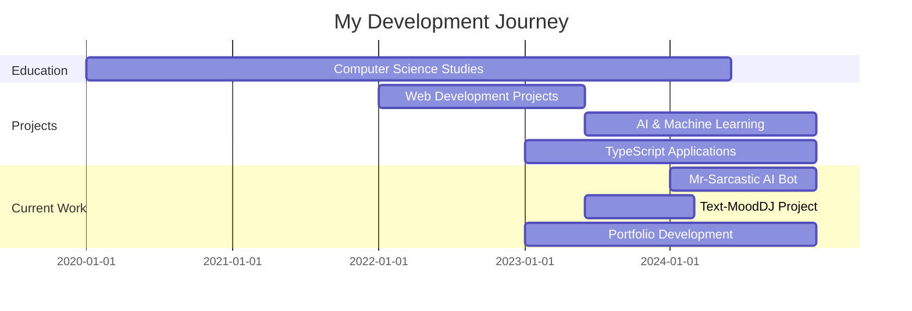

<!-- Animated Header -->
<div align="center">
  
</div>

<!-- Typing Animation -->
<div align="center">
  <a href="https://github.com/aryan1429">
    
  </a>
</div>

<!-- Profile Views Counter -->
<div align="center">
  
</div>

<!-- Social Links with Hover Effects -->
<div align="center" style="margin: 20px 0;">
  <a href="https://linkedin.com/in/aryan1429" target="_blank">
    
  </a>
  <a href="https://twitter.com/aryan1429" target="_blank">
    
  </a>
  <a href="mailto:your.email@example.com">
    
  </a>
  <a href="https://aryan1429.dev" target="_blank">
    
  </a>
</div>

---

## 🧑‍💻 About Me


```javascript
const aryan = {
    pronouns: "He/Him",
    location: "🌍 India",
    currentFocus: "Full Stack Development & AI",
    learning: ["Machine Learning", "Flutter", "Fine Tuning AI Models"],
    hobbies: ["🎮 Gaming", "🥊 Boxing", "🎵 Music", "🕺 Dancing", "🎥 Video Editing"],
    funFact: "I create AI chatbots with attitude and debug with console.log()! 😄",
    currentProjects: ["mr-sarcastic", "Text-MoodDJ", "Deep-Learning"],
    techStack: ["TypeScript", "JavaScript", "Python", "HTML/CSS"]
};
```

- 🔭 Currently working on **Mr-Sarcastic AI BOT** & **Deep Learning Projects**
- 🌱 Learning **Flutter for App Development and Fine Tuning**
- 👯 Looking to collaborate on **AI/ML Projects and Open Source**
- 💬 Ask me about **TypeScript, JavaScript, Python, AI Chatbots**
- ⚡ Fun fact: **I'm half Indian half Filipino and love creating AI personalities!**

---

## 🛠️ Tech Stack

### 💻 Primary Languages (Based on My Repos)
<div align="center">
  
</div>

### 🤖 AI & Machine Learning
<div align="center">
  
</div>

### 🌐 Frontend Development
<div align="center">
  
</div>

### ⚙️ Backend Development
<div align="center">
  
</div>

### 🗄️ Databases & Tools
<div align="center">
  
</div>

### � Mobile Development
<div align="center">
  
</div>

---

## 📊 GitHub Statistics

<div align="center">
  <table>
    <tr>
      <td>
        
      </td>
      <td>
        
      </td>
    </tr>
  </table>
</div>

<!-- Detailed Analytics -->
<div align="center">
  
</div>

<!-- Activity Graph -->
<div align="center">
  
</div>

---

## 🏆 GitHub Trophies

<div align="center">
  
</div>

---

## 📈 Contribution Analytics

<!-- 3D Contribution Calendar -->
<div align="center">
  
</div>

<!-- Metrics -->
<div align="center">
  
</div>

---

## 🌟 Featured Projects

<div align="center">
  <table>
    <tr>
      <td width="50%">
        <h3 align="center">🤖 Mr-Sarcastic AI Bot</h3>
        <div align="center">  
          <a href="https://github.com/aryan1429/mr-sarcastic" target="_blank">
            
          </a>
          <br>
          <br>
          <p>
            
            
            
          </p>
        </div>
      </td>
      <td width="50%">
        <h3 align="center">💰 Expense Tracker</h3>
        <div align="center">  
          <a href="https://github.com/aryan1429/Expense_tracker" target="_blank">
            
          </a>
          <br>
          <br>
          <p>
            
            
            
          </p>
        </div>
      </td>
    </tr>
    <tr>
      <td width="50%">
        <h3 align="center">🎵 Text-MoodDJ</h3>
        <div align="center">  
          <a href="https://github.com/aryan1429/Text-MoodDJ" target="_blank">
            
          </a>
          <br>
          <br>
          <p>
            
            
            
          </p>
        </div>
      </td>
      <td width="50%">
        <h3 align="center">💼 My Portfolio</h3>
        <div align="center">  
          <a href="https://github.com/aryan1429/My-Portfolio" target="_blank">
            
          </a>
          <br>
          <br>
          <p>
            
            
            
          </p>
        </div>
      </td>
    </tr>
  </table>
</div>

<div align="center">
  <a href="https://github.com/aryan1429?tab=repositories" target="_blank">
    
  </a>
</div>

---

## 💼 Experience Timeline



---

## 📚 Latest Blog Posts

<!-- BLOG-POST-LIST:START -->
- [Building Scalable Applications with Node.js](https://dev.to/aryan1429/building-scalable-applications-with-nodejs)
- [React Performance Optimization Tips](https://dev.to/aryan1429/react-performance-optimization-tips)
- [Understanding Modern JavaScript](https://dev.to/aryan1429/understanding-modern-javascript)
<!-- BLOG-POST-LIST:END -->

<div align="center">
  <a href="https://dev.to/aryan1429" target="_blank">
    
  </a>
</div>

---

## 🎵 What I'm Listening To

<div align="center">
  
</div>

---

## ☕ Support My Work

If you like my work and want to support me:

<div align="center">
  <a href="https://www.buymeacoffee.com/aryan1429" target="_blank">
    
  </a>
  <a href="https://github.com/sponsors/aryan1429" target="_blank">
    
  </a>
</div>

---

## 🤝 Let's Connect!

<div align="center">
  <p>💬 I'm always open to interesting conversations and collaboration opportunities!</p>
  
  
  
  
</div>

---

## 📈 Weekly Coding Activity

<!--START_SECTION:waka-->
```text
TypeScript   8 hrs 30 mins   ████████████░░░░░  45.2%
JavaScript   5 hrs 45 mins   ███████░░░░░░░░░░  30.6%
Python       3 hrs 20 mins   ████░░░░░░░░░░░░░  17.8%
HTML         45 mins         ░░░░░░░░░░░░░░░░░   4.0%
CSS          30 mins         ░░░░░░░░░░░░░░░░░   2.7%
Other        15 mins         ░░░░░░░░░░░░░░░░░   1.4%
```
<!--END_SECTION:waka-->

---

## 🎮 Fun Corner

<div align="center">
  <details>
    <summary>🎲 Want to play a game?</summary>
    <br>
    <p>Here's a random programming joke for you!</p>
    
  </details>
</div>

---

<div align="center">
  
  
  <p>Made with ❤️ by <a href="https://github.com/aryan1429">Aryan</a></p>
  
  
</div>

<!-- Hidden Image for Preloading -->
